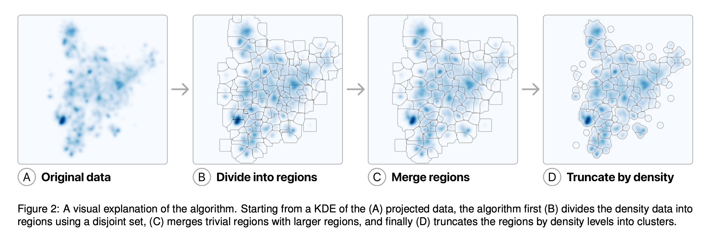
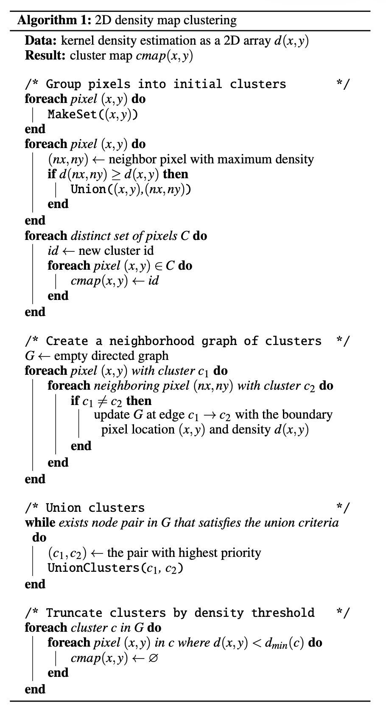

## Información Básica  
| Elemento | Detalle |
|---|---|
| **Referencia corta** | @ren2025scalable — *Clustering Embedding Projections* |
| **Título completo** | A Scalable Approach to Clustering Embedding Projections |
| **Revista / Volumen / DOI** | [arXiv:2504.07285v2](https://arxiv.org/abs/2504.07285) (16 May 2025). DOI: N/A |
| **Temática** | Visualización de embeddings; clustering basado en densidad en 2D; escalabilidad para proyecciones (UMAP/t-SNE/PCA) |
| **Contexto / Problema** | En visualizaciones de proyecciones de embeddings (scatterplots masivos), la interpretación requiere etiquetar y resumir “regiones” o clusters. Los métodos típicos (DBSCAN/Mean Shift, etc.) operan sobre puntos y se vuelven costosos a gran escala; además pueden producir clusters que se solapan al proyectar desde alta dimensión. El paper propone clusterizar sobre un mapa de densidad 2D (KDE) en lugar de sobre los puntos. |
| **Keywords** | clustering; density data; embedding projections; kernel density estimation; UMAP; visualization |
|**Code**| [https://github.com/apple/embedding-atlas](https://github.com/apple/embedding-atlas)|

## Abstract  
> **Original:**  \
> Interactive visualization of embedding projections is a useful technique for understanding data and evaluating machine learning models. Labeling data within these visualizations is critical for interpretation, as labels provide an overview of the projection and guide user navigation. However, most methods for producing labels require clustering the points, which can be computationally expensive as the number of points grows. In this paper, we describe an efficient clustering approach using kernel density estimation in the projected 2D space instead of points. This algorithm can produce high-quality cluster regions from a 2D density map in a few hundred milliseconds, orders of magnitude faster than current approaches. We contribute the design of the algorithm, benchmarks, and applications that demonstrate the utility of the algorithm, including labeling and summarization.  

> **Traducción al español:**  \
> La visualización interactiva de proyecciones de embeddings es una técnica útil para comprender datos y evaluar modelos de aprendizaje automático. El etiquetado de datos dentro de estas visualizaciones es crítico para la interpretación, ya que las etiquetas brindan una visión general de la proyección y guían la navegación del usuario. Sin embargo, la mayoría de los métodos para producir etiquetas requieren clusterizar los puntos, lo que puede ser computacionalmente costoso a medida que crece el número de puntos. En este artículo describimos un enfoque eficiente de clustering que utiliza estimación de densidad por kernel (KDE) en el espacio 2D proyectado, en lugar de operar sobre los puntos. Este algoritmo puede producir regiones de clusters de alta calidad a partir de un mapa de densidad 2D en unos pocos cientos de milisegundos, órdenes de magnitud más rápido que los enfoques actuales. Contribuimos con el diseño del algoritmo, benchmarks y aplicaciones que demuestran su utilidad, incluyendo etiquetado y resumen.

## Preguntas de Investigación / Hipótesis  

- ¿Puede un algoritmo de clustering que opera sobre un mapa de densidad 2D (KDE) generar regiones de clusters “de calidad” para proyecciones de embeddings, manteniendo coherencia visual con la percepción humana? *(inferida)*  
- ¿Qué ganancias de rendimiento (tiempo) se obtienen al clusterizar densidad 2D en vez de puntos, en datasets desde decenas de miles hasta millones de elementos, manteniendo resultados comparables a métodos escalables basados en puntos? *(inferida)*

## Metodología  

### Flujo de trabajo  

1. Proyectar embeddings de alta dimensión a 2D (p.ej., UMAP con distancia coseno).  
2. Construir un mapa de densidad 2D de la proyección mediante KDE (con técnicas eficientes de binning/aproximación; el paper reporta un cómputo de KDE en GPU/WebGL).  
3. Clusterizar el **mapa de densidad** (pixeles) usando un procedimiento en tres etapas: (i) división en regiones por “hill-climbing” hacia máximos locales, (ii) fusión (union) de regiones “triviales” cercanas a bordes, y (iii) truncamiento por umbral relativo de densidad para limpiar límites.  
4. (Post-proceso) Convertir el mapa de clusters a polígonos (p.ej., con un trazado tipo Suzuki) para visualización y/o consultas.  
5. (Aplicación demostrada) Generar etiquetas por cluster: aproximar polígonos por rectángulos no solapados y traducirlos a consultas SQL; aplicar c-TF-IDF para etiquetas en texto.

{fig-align="center" width="800"}

### Modelos / Algoritmos  

- Proyección: UMAP (mencionado explícitamente en ejemplos) con distancia coseno.  
- Densidad: KDE 2D sobre la proyección (implementación reportada en GPU/WebGL para benchmarking).  
- Clustering propuesto (sobre densidad):  
  - **Inicialización por máximos locales**: cada píxel asciende al vecino de mayor densidad hasta un máximo local; agrupa píxeles por máximo alcanzado (disjoint set / union-find).  
  - **Fusión de clusters**: usando un grafo de vecindad entre regiones; criterio: si el máximo local del cluster está muy cerca del borde, fusionar con el vecino correspondiente (greedy por prioridad).  
  - **Truncamiento**: eliminar píxeles con densidad menor a *dmin(c) = max_density(c) × factor* (factor 0.1 en el paper).  
- Baselines comparados: supercluster (Mapbox; variante rápida tipo DBSCAN), y discusión de DBSCAN/HDBSCAN/OPTICS/Mean Shift (scikit-learn) como demasiado lentos en su setting.

{fig-align="center" width="400"}

### Datos  

El trabajo evalúa el algoritmo sobre proyecciones 2D de embeddings en tres datasets representativos, cubriendo texto e imágenes y escalas desde 63k hasta 1.28M puntos. Los embeddings se proyectan (ejemplos) con UMAP y distancia coseno, luego se estima un mapa de densidad (e.g., 1000×1000 píxeles) sobre el cual se ejecuta el clustering. Además, para demostrar utilidad en etiquetado, se usa UltraChat-200k y se generan etiquetas por cluster mediante consultas SQL y c-TF-IDF en un entorno web (DuckDB WebAssembly).

| Tipo | Fuente | Cobertura temporal |
|---|---|---|
| Imágenes (ImageNet-1k; 1.28M puntos) | ImageNet Large Scale Visual Recognition Challenge | N/A |
| Texto (ACL Abstracts; 63k puntos) | Colección de abstracts ACL (referenciada en el paper) | N/A |
| Texto conversacional (UltraChat-200k; 200k puntos) | HuggingFace (UltraChat-200k) | N/A |

### Validación & Uncertainties  
La evaluación se centra en (i) **rendimiento** (tiempo de clustering) sobre tres datasets, (ii) **calidad** mediante comparación visual/cualitativa con un baseline escalable (supercluster), y (iii) **utilidad** demostrando un pipeline de etiquetado y resumen de clusters (c-TF-IDF vía SQL). No se reportan métricas estándar de “calidad de clustering” (p.ej., NMI/ARI/silhouette) ni validación cuantitativa de etiquetas; el énfasis es pragmático (interactividad, velocidad, resultados visualmente comparables).

.](images/ren-eval.png){fig-align="center" width="400"}

| Métrica | Valor | Alcance | Notas |
|---|---|---|---|
| Tiempo de clustering (Ours) | 55 ms | ACL Abstracts (63k puntos) | Sobre mapa de densidad 1000×1000. |
| Tiempo de clustering (Ours) | 52 ms | UltraChat-200k (200k puntos) | Sobre mapa de densidad 1000×1000. |
| Tiempo de clustering (Ours) | 55 ms | ImageNet-1k (1.28M puntos) | Sobre mapa de densidad 1000×1000; número de puntos es irrelevante una vez estimada la densidad. |
| Tiempo KDE (GPU/WebGL) | +41 ms | ACL Abstracts | Reportado como tiempo adicional para calcular KDE desde puntos 2D. |
| Tiempo KDE (GPU/WebGL) | +32 ms | UltraChat-200k | Reportado como tiempo adicional para calcular KDE desde puntos 2D. |
| Tiempo KDE (GPU/WebGL) | +35 ms | ImageNet-1k | Reportado como tiempo adicional para calcular KDE desde puntos 2D. |
| Tiempo supercluster | 269 ms | ACL Abstracts | Clustering sobre puntos 2D. |
| Tiempo supercluster | 913 ms | UltraChat-200k | Clustering sobre puntos 2D. |
| Tiempo supercluster | 5611 ms | ImageNet-1k | Clustering sobre puntos 2D. |
| Tiempo total (clustering+KDE) | ~80–100 ms | General | El paper sugiere que este rango podría ser usable en aplicaciones interactivas. |
| Etiquetado (c-TF-IDF vía SQL) | ~36 s | UltraChat-200k | Generación de etiquetas para 250 clusters (con dos niveles de zoom) usando DuckDB WASM. |

### Replicabilidad & Recursos  

| Ítem | Sí/No | Detalle |
|---|---|---|
| Código disponible | Sí | Implementación open-source: embedding-atlas (Apple) en GitHub. |
| Datos disponibles | Sí | Datasets mencionados son públicos (ImageNet-1k, ACL Abstracts, UltraChat-200k). |
| Parámetros reproducibles | Parcial | Se describen factores clave (p.ej., umbral 0.1 para truncamiento); detalles completos de KDE/bandwidth y configuración de proyección pueden requerir revisar código/demo. |
| Implementación descrita | Sí | Rust + compilación a WebAssembly para uso web; KDE reportado con GPU/WebGL en benchmarks. |
| Demo / herramienta | Sí | Se menciona demo interactivo y viewer web para etiquetado (DuckDB WebAssembly). |

## Resultados Clave  

- El algoritmo clusteriza un mapa de densidad 2D de 1000×1000 en ~52–55 ms en tres datasets (63k, 200k, 1.28M puntos), con complejidad dominada por el número de píxeles, no por el número de puntos.  
- En comparación, supercluster tarda 269 ms (63k), 913 ms (200k) y 5611 ms (1.28M). A escala 200k, el paper reporta ~10× de mejora en velocidad con calidad visual similar.  
- Incluyendo el cálculo de KDE en GPU/WebGL, el tiempo combinado reportado es ~80–100 ms, apuntando a uso interactivo.  
- En la demostración de etiquetado, generar etiquetas c-TF-IDF por SQL para ~250 clusters (2 niveles de zoom) en UltraChat-200k toma ~36 s (costo del resumen/etiquetado, no del clustering).

## Discusión  

- **Contribuciones:**  
  - Propone un método rápido y escalable para clustering en proyecciones de embeddings operando en densidad 2D (KDE) en lugar de puntos.  
  - Describe el algoritmo (regiones por máximos locales + fusión + truncamiento), análisis de complejidad y benchmarks comparativos.  
  - Muestra aplicaciones para etiquetado y resumen: polígonos → consultas SQL → c-TF-IDF.  
- **Limitaciones:**  
  - Produce una lista plana de clusters (sin jerarquía explícita); para multiescala se sugiere ejecutar con múltiples bandwidths, pero sin relación jerárquica formal.  
  - No incorpora metadatos categóricos (solo clusteriza un mapa de densidad único).  
  - Está limitado al espacio proyectado 2D: puede alinearse con percepción humana, pero no garantiza fidelidad a clusters en alta dimensión.  
- **Futuro:**  
  - Desarrollar clustering jerárquico multiescala con relaciones consistentes entre niveles.  
  - Extender el método para considerar variables categóricas/metadata al formar clusters.  

## Aplicabilidad en Chile  

| Aspecto | Evaluación |
|---|---|
| Exploración territorial con embeddings | Alta: útil para explorar grandes colecciones de embeddings (p.ej., parches de imágenes satelitales de Chile, POIs, **Delitos**), proyectarlas a 2D y generar regiones/etiquetas rápidamente para análisis exploratorio. |
| Integración con SIG / consultas espaciales | Media–Alta: los clusters como polígonos 2D facilitan consultas tipo “range query” y agregación; habría que mapear estos polígonos al contexto SIG (nota: son polígonos en el espacio de proyección, no geográficos). |
| Interpretabilidad para tomadores de decisión | Media: mejora navegación/overview y permite etiquetado; sin embargo, la interpretación depende de la calidad del embedding/proyección y de la semántica del etiquetado (especialmente en dominios territoriales). |
| Riesgos / sesgos | Media: al operar en 2D, la proyección puede distorsionar relaciones; los clusters reflejan estructura proyectada, no necesariamente estructura “real” del fenómeno territorial. |
| Costos de adopción | Baja–Media: código abierto y orientado a web (Rust/WASM), pero requiere pipeline de embeddings + proyección + KDE y (si se desea) infraestructura de etiquetado/DB. |

## Madurez & Evidencia  

| Eje | Nivel |
|---|---|
| Evidencia empírica (benchmarks) | Media–Alta |
| Escalabilidad / rendimiento | Alta |
| Validación de calidad de clustering | Media (principalmente cualitativa vs. baseline) |
| Disponibilidad de implementación | Alta (open-source) |
| Transferibilidad a dominios territoriales | Media (requiere embeddings/proyecciones adecuadas) |

## Impacto en Políticas Públicas / ODS  

> Potencial habilitador (indirecto): al acelerar la clusterización y el etiquetado de proyecciones de embeddings, el enfoque puede facilitar sistemas de análisis exploratorio para grandes repositorios de datos relevantes para políticas públicas (p.ej., monitoreo ambiental, clasificación de reportes ciudadanos, análisis de documentos normativos). Su contribución es metodológica/infraestructural (visual analytics) más que un caso aplicado a un ODS específico, por lo que el impacto depende del caso de uso que se implemente (p.ej., ODS 11 ciudades sostenibles, ODS 13 acción por el clima, ODS 15 vida de ecosistemas terrestres).

